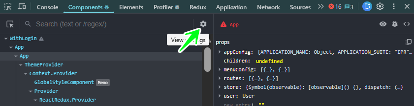
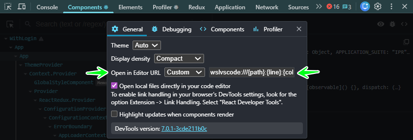
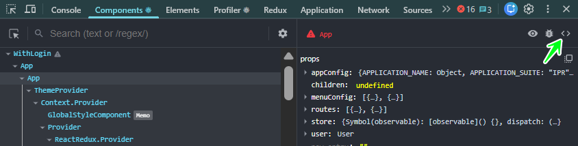

# `wslvscode://` Custom Protocol Launcher

This solution provides a custom URI protocol handler (`wslvscode://`) to open files and folders in Visual Studio Code within your default WSL environment directly from a web browser address bar or application links.

---

## 🛠️ Prerequisites

- Windows 10/11 with a default WSL distribution configured.
- Visual Studio Code installed on Windows with the official WSL extension.
- The VS Code CLI command (`code`) must be accessible within your default WSL distribution.
- The required PowerShell scripts (`Launch-WslVscode.ps1` and `Manage-WslVscodeProtocol.ps1`) must be created and placed as instructed in prior steps.

---

## 🚀 Usage

Once the protocol has been installed using the management script (`Manage-WslVscodeProtocol.ps1`), you can use the `wslvscode://` protocol in your browser address bar or within other applications that support links:

- **To open a specific file:**
  `wslvscode:///home/{WSL-USER}/projects/my-file.tsx`

- **To open a directory/folder:**
  `wslvscode:///home/{WSL-USER}/projects/`

A security prompt will appear in your browser the first time you use it; accept it to launch VS Code directly in your WSL environment.

## ⚛️ Configure React Developer Tools

Enable "Open in Editor" to jump from a React component in your browser to its code in VS Code (WSL).

1.  **Open Chrome DevTools** (`F12` or "Inspect").
2.  Go to the **"Components" Tab**.
3.  Click the **gear icon (⚙️)** for settings.

4.  In "General" settings, under "Open in Editor URL", select "Custom" and paste:

    `wslvscode:///{path}:{line}:{column}`

    - This `wslvscode://` protocol uses our `Launch-WslVscode.ps1` script.
    - `{path}`, `{line}`, `{column}` are placeholders for file location.

After configuration, click the "Open in Editor" icon (`<>`) in React DevTools to open the component's source in VS Code (WSL).

